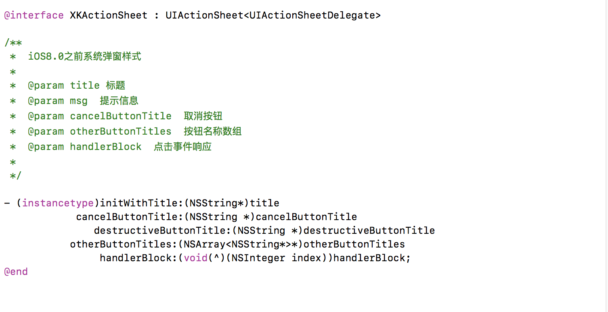
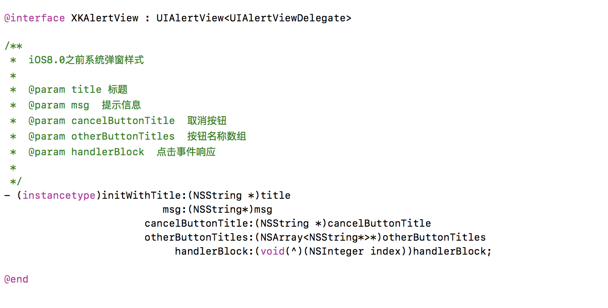
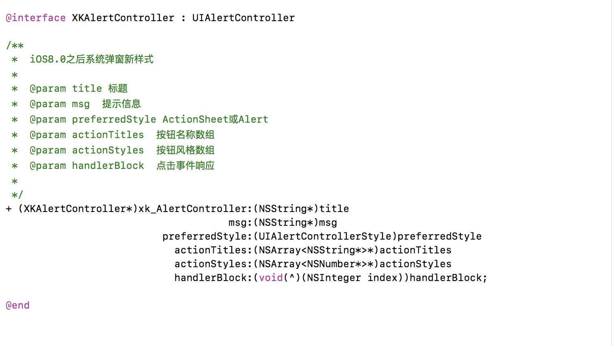

# XKAlertController

[](https://travis-ci.org/ALLen、LAS/XKAlertController)
[](http://cocoapods.org/pods/XKAlertController)
[](http://cocoapods.org/pods/XKAlertController)
[](http://cocoapods.org/pods/XKAlertController)

## Example

To run the example project, clone the repo, and run `pod install` from the Example directory first.

## Method
常见系统弹窗:UIAlertView、UIActionSheet、UIAlertController初始化方法的封装:





## Installation

XKAlertController is available through [CocoaPods](http://cocoapods.org). To install
it, simply add the following line to your Podfile:

```ruby
pod 'XKAlertController'
```

## Author

ALLen、LAS, 1696186412@qq.com

## License

XKAlertController is available under the MIT license. See the LICENSE file for more info.
